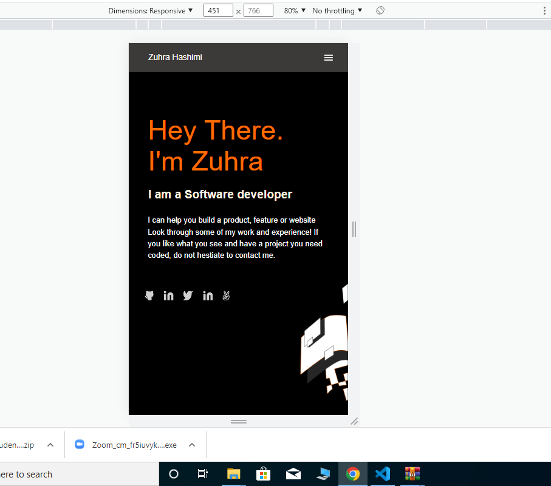

# Personal Portfolio Page

> This is the mobile version of a personal portfolio page that shows of my accomplishments as a software developer.

## Built With

- HTML and CSS

## Getting Started

To get a local copy up and running follow these simple example steps.

### Prerequisites
- A simple web browser (preferably Chrome or Firefox)
- An IDE

### Setup
- Download this repository and open index.html file.

## Authors

👤 **Zuhra Hashimi**

- GitHub: [@ZuhRa-HashiMi](https://github.com/ZuhRa-HashiMi)
- Twitter: [@ZuhraHashimi4](https://twitter.com/ZuhraHashimi4)
- LinkedIn: [zuhra-hashimi](https://www.linkedin.com/in/zuhra-hashimi-601966214/)

## 🤝 Contributing

Contributions, issues, and feature requests are welcome!
